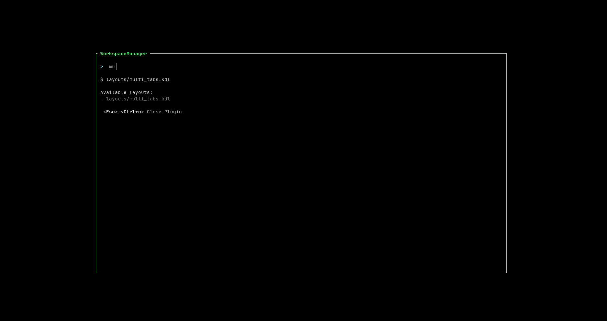

# Zellij Workspace 

A [Zellij](https://zellij.dev) plugin for opening single or multi tabs [layouts](https://zellij.dev/documentation/layouts) within an existing zellij session. 




## Requirements

Zellij version `v0.38.0` or later.

### Zellij Plugin Permission 

| Permission               | Why                                         |
| -------------------------|---------------------------------------------|
| `ReadApplicationState`   | Subscribe to Pane and tab events            |
| `ChangeApplicationState` | Setting plugin pane name, creating new tabs |

### Host Filesystem Access

[Zellij maps the folder where Zellij was started](https://zellij.dev/documentation/plugin-api-file-system) to `/host` path on the plugin (e.g. your home dir or `default_cwd` in your zellij or the current dir where you started your zellij session).

The plugin will look for a `/host/.zellij-workspace` file (i.e. at the root of the dir of you current zellij session) to load a list of zellij layouts (relative path from your zellij session `cwd`).

Example of a `.ghost` file:
```bash
.config/zellij/layouts/my_custom_layout.kdl
## this is a comment starting with '#'
	# this is also a comment


## empty lines are also ignored
.config/zellij/layouts/another_layout.kdl
```

## Loading plugin 

### Via Zellij Config

```kdl
shared_except "locked" {
    bind "Ctrl y" {
        LaunchOrFocusPlugin "file:~/.config/zellij/plugins/zellij-workspace.wasm" {
            floating true

            debug false                     // display debug info, config, parse command etc
        }
    }
}
```

### Via CLI

```bash
zellij action launch-or-focus-plugin --floating "file:$HOME/.config/zellij/plugins/zellij-workspace.wasm"
```


